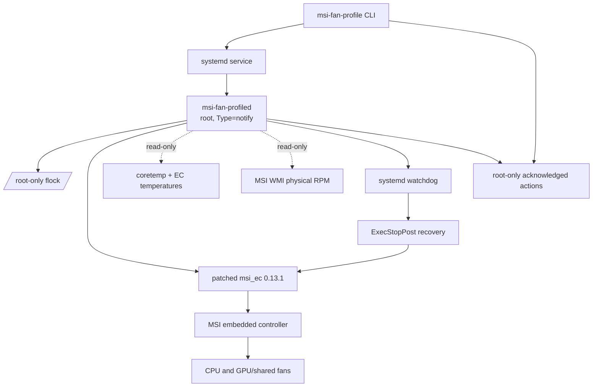

# Architecture

## Control plane

The manager accepts only five exact commands. There is no command for arbitrary
curve bytes or EC addresses.

The daemon holds the shared fan-control lock for its lifetime. It writes only to:

- apply/reapply the one compiled Candidate 14 curve;
- select `auto` or `advanced` in safe order;
- enable or release Cooler Boost;
- restore the exact factory curve.

## Data plane

The EC controls fan speed from the resident curve. Runtime monitoring reads:

- CPU package temperature;
- EC CPU/GPU temperature;
- physical fan RPM;
- curve, mode, Boost, firmware, driver, BIOS, board, and product identity.

No polling loop writes target RPM.

## Recovery plane

A clean stop restores factory `auto/off`. A failed service invokes a separately
root-owned `ExecStopPost` helper after systemd terminates the service cgroup. The
helper validates immutable identity, waits for the shared lock, restores the
factory curve and auto mode, and leaves Cooler Boost on.

`Restart=no` makes failures visible and avoids a loop repeatedly touching the EC.
