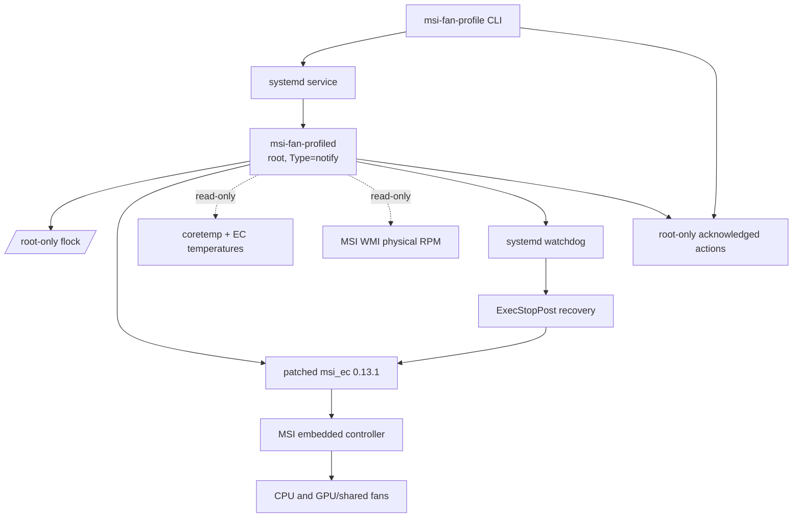

# Architecture

```mermaid
flowchart TD
    systemd[systemd service] --> daemon[msi-fan-profiled\nroot, Type=notify]
    daemon --> lock[/root-only flock/]
    daemon --> driver[patched msi_ec 0.13.1]
    driver --> ec[MSI embedded controller]
    ec --> fans[CPU and GPU/shared fans]
    daemon -. read-only .-> temps[coretemp + EC temperatures]
    daemon -. read-only .-> rpm[MSI WMI physical RPM]
    daemon --> watchdog[systemd watchdog]
    watchdog --> recovery[ExecStopPost recovery]
    recovery --> driver
    manager[msi-fan-profile CLI] --> systemd
    manager --> ack[root-only acknowledged actions]
    daemon --> ack
```

## Control plane

The manager accepts only five exact commands. There is no command for arbitrary
curve bytes or EC addresses.

The daemon holds the shared fan-control lock for its lifetime. It writes only to:

- apply/reapply the one compiled Candidate 14 curve;
- select `auto` or `advanced` in safe order;
- enable or release Cooler Boost;
- restore the exact factory curve only for an operator-directed factory
  transition, including a clean stop and `factory-auto`.

## Data plane

The EC controls fan speed from the resident curve. Runtime monitoring reads:

- CPU package temperature;
- EC CPU/GPU temperature;
- physical fan RPM;
- curve, mode, Boost, firmware, driver, BIOS, board, and product identity.

No polling loop writes target RPM.

## Recovery plane

A clean stop restores factory `auto/off`. An explicit `factory-auto` request,
a manager setup failure before a service start is attempted, and the attended
installation/upgrade transition also deliberately use the factory
configuration. Those are operator-directed state changes, not runtime-fault
recovery. Once the manager has attempted service start, it deliberately leaves
the service state and its runtime recovery untouched.

A failed service invokes a separately root-owned `ExecStopPost` helper after
systemd terminates the service cgroup. After validating immutable identity and
waiting for the shared lock, the helper requests Cooler Boost, stages the
compiled Candidate 14 curve safely, returns the EC to `advanced` mode, and
checks the final state. It verifies both physical fans when valid WMI RPM
telemetry is available. It does not restore the factory curve on a runtime
fault; if identity is unknown, it performs no model-specific write and reports
that limitation.

`Restart=no` makes the primary failure visible and avoids a loop repeatedly
restarting the controller. Its `OnFailure` handoff starts a separate,
watchdog-protected keeper only after the post-stop helper completes. That keeper
holds the shared lock and continuously repairs Candidate 14/`advanced`/Boost
drift without interpreting incomplete telemetry as permission to release Boost.
The guarded manager stops the keeper before it starts the primary daemon or
performs a factory transition.
