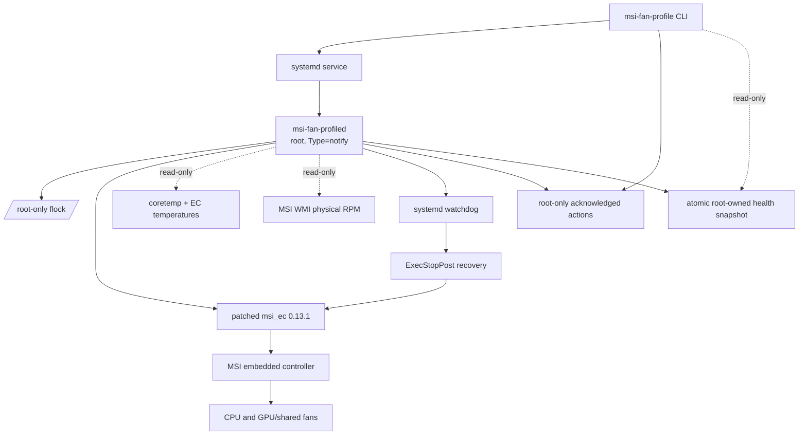

# Architecture

```mermaid
flowchart TD
    systemd[systemd service] --> daemon[msi-fan-profiled\nroot, Type=notify]
    daemon --> lock[/root-only flock/]
    daemon --> driver[patched msi_ec 0.13.1]
    driver --> ec[MSI embedded controller]
    ec --> fans[CPU and GPU/shared fans]
    daemon -. read-only .-> temps[coretemp + EC temperatures]
    daemon -. read-only .-> rpm[MSI WMI physical RPM]
    daemon --> watchdog[systemd watchdog]
    watchdog --> recovery[ExecStopPost recovery]
    recovery --> driver
    manager[msi-fan-profile CLI] --> systemd
    manager --> ack[root-only acknowledged actions]
    daemon --> ack
    daemon --> health[atomic root-owned health snapshot]
    manager -. read-only .-> health
```

## Control plane

The manager accepts only five exact commands. There is no command for arbitrary
curve bytes or EC addresses.

The daemon holds the shared fan-control lock for its lifetime. It writes only to:

- apply/reapply the one compiled Candidate 14 curve;
- select `auto` or `advanced` in safe order;
- enable or release Cooler Boost;
- restore the exact factory curve only for an operator-directed factory
  transition, including a clean stop and `factory-auto`.

## Data plane

The EC controls fan speed from the resident curve. Runtime monitoring reads:

- CPU package temperature;
- EC CPU/GPU temperature;
- physical fan RPM;
- curve, mode, Boost, firmware, driver, BIOS, board, and product identity.

No polling loop writes target RPM.

`msi_fan_control.py` centralizes two exact driver-build pins. The legacy build
uses the existing attributes. The snapshot build requires its read-only
`fan_control_snapshot` ABI: one fresh firmware check and 26 curve bytes plus
shift/mode/Boost/EC temperatures under the driver control mutex (43 EC reads).
It is serialized against this driver's curve/mode/Boost stores, not claimed
atomic against firmware's own autonomous updates. CPU package and WMI RPM stay
separate. Every mutation still performs its own fresh identity check. A missing,
malformed, unsupported or failed new ABI never falls back to legacy controls.

Snapshot acquisition and the remaining telemetry share one two-second freshness
envelope; resume and reapplication invalidate and reacquire EC temperatures.
Optional timing diagnostics use an explicit startup environment switch and are
absent by default. Necessary safety timekeeping is never optional.

Each telemetry channel is plausibility-checked independently. Valid fan channels
remain monitored even if a temperature is unavailable. Runtime Boost response
verification is incremental; missing samples reset low-RPM evidence, and an
isolated low spin-up reading followed by missing telemetry is not proof of a
fan failure. The 3,000 RPM response floor is not a maximum-speed measurement.

The primary publishes a PID-bound, monotonic-timestamped health snapshot before
readiness and after each monitoring pass. The manager separates configuration
stability from dynamic health. Cooldown waits hold no manager lock, allowing a
newer manual-on request to cancel a pending release. Suspend, invalid telemetry,
or observation gaps over two seconds reset cooldown progress.

## Recovery plane

A clean stop restores factory `auto/off`. An explicit `factory-auto` request,
a manager setup failure before a service start is attempted, and the attended
installation/upgrade transition also deliberately use the factory
configuration. Those are operator-directed state changes, not runtime-fault
recovery. Once the manager has attempted service start, it deliberately leaves
the service state and its runtime recovery untouched.

A failed service invokes a separately root-owned `ExecStopPost` helper after
systemd terminates the service cgroup. After validating immutable identity and
waiting for the shared lock, the helper requests Cooler Boost, stages the
compiled Candidate 14 curve safely, returns the EC to `advanced` mode, and
checks the final state. It verifies both physical fans when valid WMI RPM
telemetry is available. It does not restore the factory curve on a runtime
fault; if identity is unknown, it performs no model-specific write and reports
that limitation.

`Restart=no` makes the primary failure visible and avoids a loop repeatedly
restarting the controller. Its `OnFailure` handoff starts a separate,
watchdog-protected keeper only after the post-stop helper completes. That keeper
holds the shared lock and continuously repairs Candidate 14/`advanced`/Boost
drift without interpreting incomplete telemetry as permission to release Boost.
It samples fan response once per repair pass rather than blocking in a retry
loop, and reports unverified response without pausing one-second control repair.
The recovery path also creates a root-only, same-boot recovery-Boost marker.
The guarded manager stops the keeper before it starts the primary daemon; after
the daemon has reapplied and verified Candidate 14, it consumes the marker and
treats the inherited Boost as an automatic latch. It may then release only after
30 continuously valid, cool seconds. A verified `factory-auto` transition clears
the marker instead.
